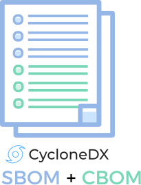
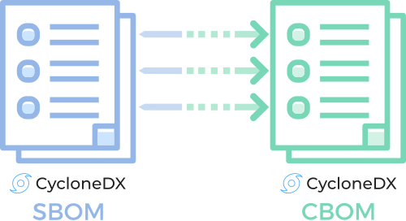

---
# Page settings
layout: document
keywords: application security, software security, software bill of material, SBOM, BOM, open source, supply chain, specification, spdx, license, package url, purl, cpe
comments: false
banner: false

# Hero section
title: Cryptography Bill of Materials (CBOM)
window_title: CycloneDX - Cryptography Bill of Materials (CBOM)
description: Cryptography Bill of Materials (CBOM)

# Micro navigation
micro_nav: false

breadcrumbs:
  - title: CYCLONEDX
  - title: GETTING STARTED
  - title: CAPABILITIES
  - title: CBOM

# Page navigation
    
---

# Cryptography Bill of Materials (CBOM)

&nbsp;<!-- without this hack, the dropdown menu has issues due to h1 and h2 happening right after each other -->

Discover, manage and report on cryptography in preparation for quantum safe systems and applications



A Cryptography Bill of Materials (CBOM) describes cryptographic assets and their dependencies. Discovering, managing,
and reporting on cryptographic assets is necessary as the first step on the migration journey to quantum-safe systems
and applications. Cryptography is typically buried deep within components used to compose and build systems and
applications. As part of an agile cryptographic approach, organizations should seek to understand what cryptographic
assets they are using and facilitate the assessment of the risk posture to provide a starting point for mitigation.

## BOM With Embedded Cryptographic Assets
CycloneDX supports embedding cryptographic assets into existing SBOM or HBOMs. Leveraging this approach has the benefit
in that the dependency graph can include all software and hardware components, their dependencies, and which
components provide various cryptographic capabilities.

{: width="205" }

## Independent SBOM and CBOM
To facilitate cryptographic agility, independent SBOM/HBOM and CBOM may be leveraged and optionally specify the 
configuration made to enable or disable cryptographic features and functions. 

{: width="500" }

## High-Level Object Model
{: width="900"}

## Examples

BOMs demonstrating CBOM capabilities can be found at
[https://github.com/CycloneDX/bom-examples](https://github.com/CycloneDX/bom-examples)

## Additional Capabilities

