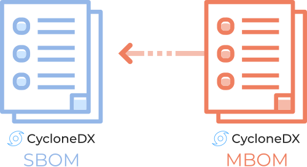

---
# Page settings
layout: document
keywords: application security, software security, software bill of material, SBOM, BOM, open source, supply chain, specification, spdx, license, package url, purl, cpe
comments: false
banner: false

# Hero section
title: Manufacturing Bill of Materials (MBOM)
window_title: CycloneDX - Manufacturing Bill of Materials (MBOM)
description: Manufacturing Bill of Materials (MBOM)

# Micro navigation
micro_nav: false

breadcrumbs:
  - title: CYCLONEDX
  - title: GETTING STARTED
  - title: CAPABILITIES
  - title: MBOM

# Page navigation
    
---

# Manufacturing Bill of Materials (MBOM)

&nbsp;<!-- without this hack, the dropdown menu has issues due to h1 and h2 happening right after each other -->

Declared and observed formulation for reproducibility throughout product lifecycle



CycloneDX can describe declared and observed formulations for reproducibility throughout the product lifecycle of components
and services. This advanced capability provides transparency into how components were made, how a model was trained, or
how a service was created or deployed. In addition, every component and service in a CycloneDX BOM can optionally specify
formulation and do so in existing BOMs or in dedicated MBOMs. By externalizing formulation into dedicated MBOMs, SBOMs
can link to MBOMs for their components and services, and access control can be managed independently. This allows
organizations to maintain tighter control over what parties gain access to inventory information in a BOM and what parties
have access to MBOM information which may have higher sensitivity and data classification.

## Independent MBOM and SBOM
Independent access controls can be established by separating the SBOM inventory from potentially highly-sensitive MBOM 
data. This allows organizations to provide SBOMs to a broader audience while keeping stricter control over who has access
to the MBOM.

{: width="500" }

## High-Level Object Model
{: width="900"}

## References

* [BSIMM SE3.6 - Enhance application inventory with operations bill of materials](https://www.bsimm.com/framework/deployment/software-environment.html)

## Examples

BOMs demonstrating OBOM capabilities can be found at
[https://github.com/CycloneDX/bom-examples](https://github.com/CycloneDX/bom-examples)

## Additional Capabilities

