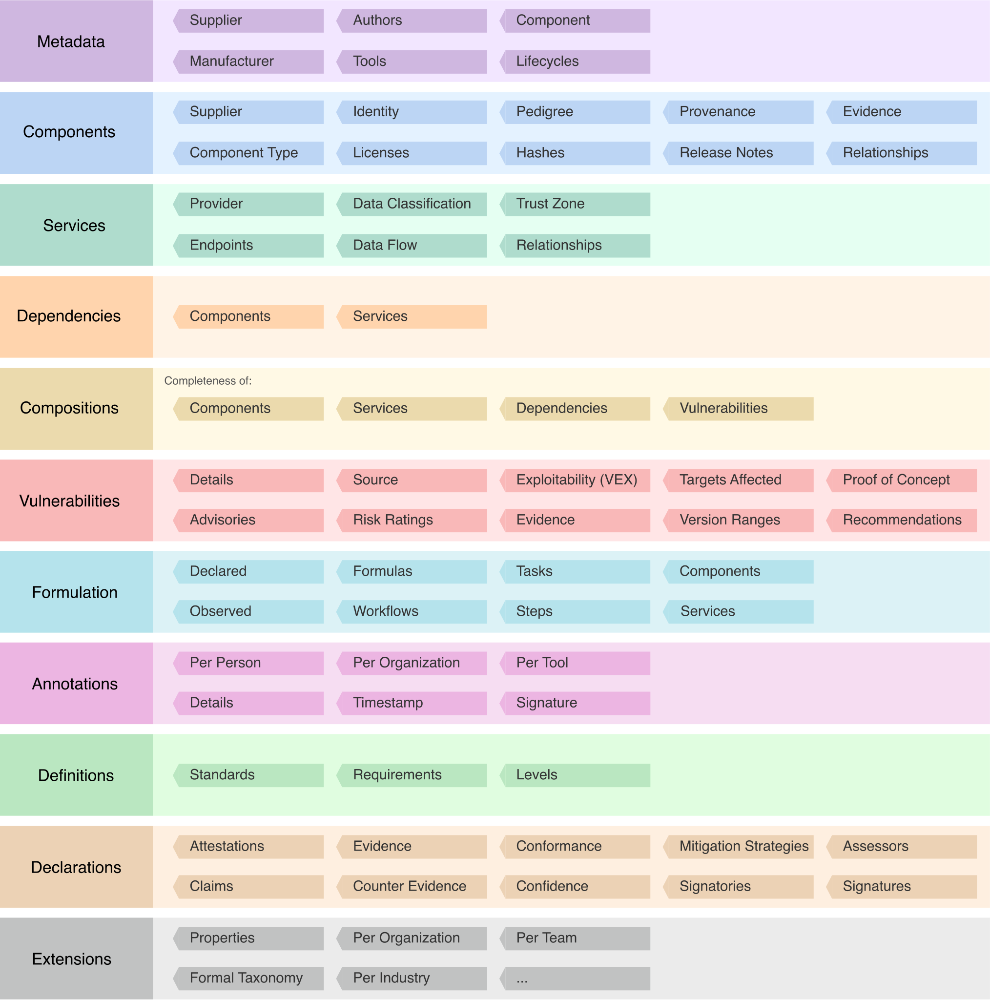

---
# Page settings
layout: document
keywords: application security, software security, software bill of material, SBOM, BOM, open source, supply chain, specification, spdx, license, package url, purl, cpe
comments: false
banner: false

# Hero section
title: Operations Bill of Materials (OBOM)
window_title: CycloneDX - Operations Bill of Materials (OBOM)
description: Operations Bill of Materials (OBOM)

# Micro navigation
micro_nav: false

# Page navigation
    
---

# Operations Bill of Materials (OBOM)

&nbsp;<!-- without this hack, the dropdown menu has issues due to h1 and h2 happening right after each other -->



CycloneDX is a full-stack bill of materials standard supporting entire runtime environments consisting of hardware,
firmware, containers, operating systems, applications and their libraries. Coupled with the ability to specify configuration
makes CycloneDX ideal for Operational Bill of Materials. OBOM is a security behavior defined in [BSIMM](https://www.bsimm.com/)
and similar maturity models.

CycloneDX properties provide a mechanism to store configuration on a per-component and per-service basis inside a BOM. 
The specification also provides a mechanism to store URLs to documentation, including configuration management systems.

## High-Level Object Model

{: width="900"}

## References

* [BSIMM SE3.6 - Enhance application inventory with operations bill of materials](https://www.bsimm.com/framework/deployment/software-environment.html)
