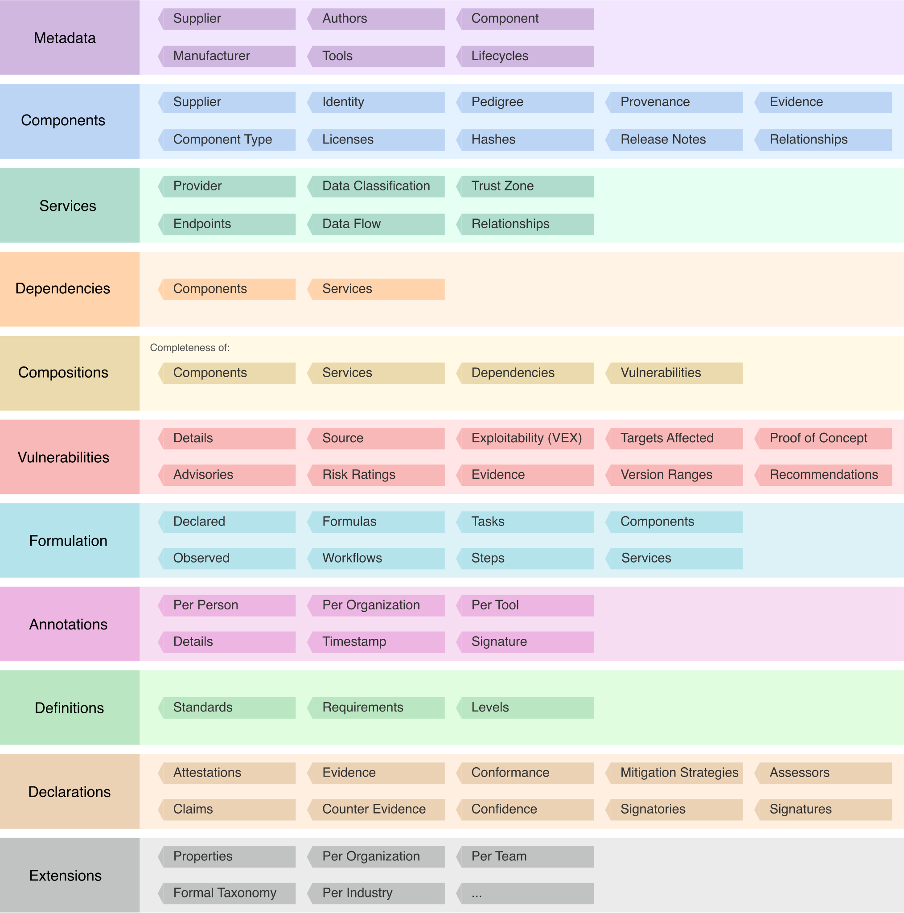

---
# Page settings
layout: document
keywords: application security, software security, software bill of material, SBOM, BOM, open source, supply chain, specification, spdx, license, package url, purl, cpe
comments: false
banner: false

# Hero section
title: Common Release Notes Format
window_title: CycloneDX - Common Release Notes Format
description: Common Release Notes Format

# Micro navigation
micro_nav: false

breadcrumbs:
  - title: CYCLONEDX
  - title: GETTING STARTED
  - title: CAPABILITIES
  - title: RELEASE NOTES

# Page navigation
    
---

# Common Release Notes Format

&nbsp;<!-- without this hack, the dropdown menu has issues due to h1 and h2 happening right after each other -->

Standardizes release notes unlocking new workflows for software publishers and consumers



CycloneDX standardizes release notes into a common, machine-readable format. This capability unlocks new workflow
potential for software publishers and consumers alike. This functionality works with or without the Bill of Materials
capabilities of the spec.

- Provides a common format in which to consume or publish release notes
- Every component and service may optionally contain release notes
- Helps reduce risk and operational expense by providing upgrade and security information to consumers
- Release notes include everything necessary for publishing into multiple formats, including:
  - Version information
  - Multilingual descriptions
  - Tags to aid search engines
  - Issues (defects, enhancements, and security) resolved in a release
  - Featured and social images

## High-Level Object Model

{: width="900"}

## Additional Capabilities

