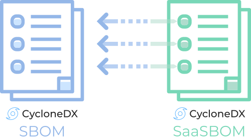
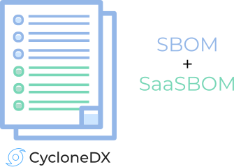

---
# Page settings
layout: document
keywords: application security, software security, software bill of material, SBOM, BOM, open source, supply chain, specification, spdx, license, package url, purl, cpe
comments: false
banner: false

# Hero section
title: Software-as-a-Service BOM (SaaSBOM)
window_title: CycloneDX - Software-as-a-Service BOM (SaaSBOM)
description: Software-as-a-Service BOM (SaaSBOM)

# Micro navigation
micro_nav: false

# Page navigation
    
---

# Software-as-a-Service BOM (SaaSBOM)

&nbsp;<!-- without this hack, the dropdown menu has issues due to h1 and h2 happening right after each other -->



Modern software often relies on external services, or is made up entirely of services. CycloneDX is capable of describing any type of service including:
- Microservice Architecture
- Service Orientated Architecture (SOA)
- Function as a Service (FaaS)
- n-Tier Architecture
- Actor model
- System of Systems

SaaSBOMs compliment Infrastructure-as-Code (IaC) by providing a logical representation of a complex system, complete with
inventory of all services, their reliance on other services, endpoint URLs, data classifications, and the directional
flow of data between services. Optionally, SaaSBOMs may also include the software components that make up each service.

CycloneDX is protocol agnostic and is capable of describing services over HTTP(S), REST, GraphQL, MQTT, and intra-process communication.
The specification provides enough information about services to automatically generate dataflow diagrams useful in 
security and privacy threat modeling. Refer to [Use Cases](../../use-cases) for details on services.

Use of CycloneDX SaaSBOMs is recommended by the [Cloud Security Alliance](https://cloudsecurityalliance.org/).

## Independent SBOM and SaaSBOM
The inventory of services and software components may be combined into a single BOM, or may have independent BOMs.
Inventory described in an SBOM will typically remain static until such time the inventory changes.
However, deployment information is much more dynamic and subject to change. Therefore, it is recommended to decouple
the SaaSOMs from the SBOMs for large systems. This allows service information to be updated without having to create 
and track additional SBOMs.

{: width="500" }

When SaaSBOMs are decoupled from SBOMs, it is possible for every service defined in an SaaSBOM to reference its 
corresponding SBOM. In the case of large microservice architectures, this would typically result in a one to many
relationship with a single SaaSBOM and many SBOMs. Each service in the SaaSBOM would reference its corresponding SBOM.

With CycloneDX, it is possible to reference a component, service, or vulnerability inside a BOM from other systems or
other BOMs. This deep-linking capability is referred to as [BOM-Link](../bomlink) and is a 
[formally registered URN](https://www.iana.org/assignments/urn-formal/cdx).

Learn more about how CycloneDX makes use of [BOM-Link](../bomlink).

## SBOM With Embedded Services

{: width="334" }

CycloneDX also supports embedding services information inside a BOM. There are several uses for embedding services including:

* Organizations with a shared responsibility model for software development and deployment
* SBOMs containing components that may rely on external services with the goal of augmenting the SBOM with these services

## High-Level Object Model

{: width="900"}

## Examples

BOMs demonstrating SaaSBOM capabilities can be found at
[https://github.com/CycloneDX/sbom-examples](https://github.com/CycloneDX/sbom-examples)
