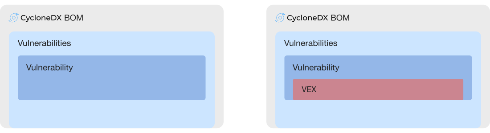
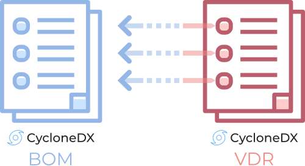
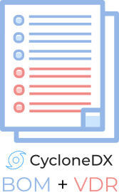

---
# Page settings
layout: document
keywords: application security, software security, software bill of material, SBOM, BOM, open source, supply chain, specification, spdx, license, package url, purl, cpe
comments: false
banner: false

# Hero section
title: Vulnerability Disclosure Report (VDR)
window_title: CycloneDX - Vulnerability Disclosure Report (VDR)
description: Vulnerability Disclosure Report (VDR)

# Micro navigation
micro_nav: false

# Page navigation
    
---

# Vulnerability Disclosure Report (VDR)

&nbsp;<!-- without this hack, the dropdown menu has issues due to h1 and h2 happening right after each other -->



Known vulnerabilities inherited from the use of third-party and open source software can be communicated with CycloneDX. 
Previously unknown vulnerabilities affecting both components and services may also be disclosed using CycloneDX, making 
it ideal for Vulnerability Disclosure Report (VDR) use cases.

[NIST SP 800-161: Cybersecurity Supply Chain Risk Management Practices for Systems and Organizations](https://csrc.nist.gov/publications/detail/sp/800-161/rev-1/final)
defines Vulnerability Disclosure Reports (VDR) as a best practice and recommends VDRs include:
- Analysis and findings describing the impact (or lack thereof) that a reported vulnerability has on a component or product
- Plans to address the vulnerability
- Signing the VDR with a trusted, verifiable, private key that includes a timestamp indicating the date and time of the VDR signature
- Publishing the VDR to a secure portal

CycloneDX exceeds the data field requirements defined in [ISO/IEC 29147:2018](https://www.iso.org/standard/72311.html) 
for vulnerability disclosure information and provides a simple path for including [Vulnerability Exploitability eXchange (VEX)](../vex) 
information. 

## VDR Support in CycloneDX
CycloneDX fully supports all NIST recommendations for VDR including:
- Optional analysis of the impact of each reported vulnerability against a component, service, or product
- Plans to address the vulnerability
- Enveloped [signatures using XML Signature or JSON Signature Format](https://cyclonedx.org/use-cases/#authenticity), or detached signatures
- Publishing to a security portal via the [CycloneDX BOM Exchange API](https://github.com/CycloneDX/cyclonedx-bom-exchange-api) which is implemented in the [CycloneDX BOM Repository Server](https://github.com/CycloneDX/cyclonedx-bom-repo-server)

{: width="500" }

With CycloneDX, it is possible to reference a component, service, or vulnerability inside a BOM from other systems or
other BOMs. This deep-linking capability is referred to as [BOM-Link](../bomlink) and is a
[formally registered URN](https://www.iana.org/assignments/urn-formal/cdx).

Learn more about how CycloneDX makes use of [BOM-Link](../bomlink).

CycloneDX VDR BOMs can also be used with alternative SBOM formats such as SPDX, but without the tight integration or
support of an [IETF standard](https://www.iana.org/assignments/urn-namespaces) for linkage. Vendor support may vary.

## BOM With Embedded VDR

{: width="167" }

CycloneDX also supports embedding VDR information inside a BOM, thus having a single artifact that describes both
inventory and VDR data. There are several uses for embedding VDR data including:

* Audit use cases where inventory and vulnerability data need to be captured at a specific point in time
* Automated security tools may opt to create a single BOM with embedded vulnerability or VDR data for convenience and portability

## High-Level Object Model

{: width="900"}

## Examples

BOMs demonstrating VDR capabilities can be found at
[https://github.com/CycloneDX/bom-examples](https://github.com/CycloneDX/bom-examples)