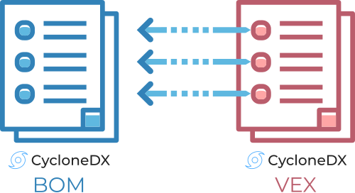
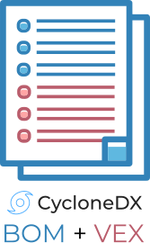

---
# Page settings
layout: document
keywords: application security, software security, software bill of material, SBOM, BOM, open source, supply chain, specification, spdx, license, package url, purl, cpe
comments: false
banner: false

# Hero section
title: Vulnerability Exploitability Exchange (VEX)
window_title: CycloneDX - Vulnerability Exploitability Exchange (VEX)
description: Vulnerability Exploitability Exchange (VEX)

# Micro navigation
micro_nav: false

# Page navigation
    
---

# Vulnerability Exploitability Exchange (VEX)

&nbsp;<!-- without this hack, the dropdown menu has issues due to h1 and h2 happening right after each other -->



Known vulnerabilities inherited from the use of third-party and open source software and the exploitability of the vulnerabilities
can be communicated with CycloneDX. Previously unknown vulnerabilities affecting both components and services may also be disclosed
using CycloneDX, making it ideal for both VEX and security advisory use cases.
- VEX information can be represented inside an existing BOM, or in a dedicated VEX BOM
- Supports known and unknown vulnerabilities against components and services
- Communicates the vulnerability details, exploitability, and detailed analysis

## Independent BOM and VEX BOM
Inventory described in a BOM (SBOM, SaaSBOM, etc) will typically remain static until such time the inventory changes. 
However, vulnerability information is much more dynamic and subject to change. Therefore, it is recommended to decouple 
the VEX from the BOM. This allows VEX information to be updated without having to create and track additional BOMs.

VEX is an integral part of the CycloneDX specification providing the convenience of leveraging a single format and tool chain.

{: width="500" }

With CycloneDX, it is possible to reference a component, service, or vulnerability inside a BOM from other systems or 
other BOMs. This deep-linking capability is referred to as [BOM-Link](../rfc-tbd) and is defined in IETF 
[RFC-TBD](https://datatracker.ietf.org/doc/html/rfcTBD).

Learn more about how CycloneDX makes use of [BOM-Link](../rfc-tbd).

## BOM With Embedded VEX

{: width="167" }

CycloneDX also supports embedding VEX information inside a BOM, thus having a single artifact that describes both
inventory and VEX data. There are several uses for embedding VEX data including:

* Audit use cases where inventory and vulnerability data need to be captured at a specific point in time
* Automated security tools may opt to create a single BOM with embedded vulnerability or VEX data for convenience and portability

## CycloneDX and Third-Party Advisory Formats

Every component or service defined in a CycloneDX BOM may optionally define external references to security advisory 
feeds. CycloneDX is agnostic to the advisory format, however, the 
[Common Security Advisory Framework (CSAF)](https://www.oasis-open.org/committees/csaf), an OASIS Open standard, is 
recommended. Refer to the [Security Advisories Use Case](../../use-cases/#security-advisories) for more information.

CSAF also supports an optional VEX profile which can be used with CycloneDX.

## Documentation and Examples

Detailed support for vulnerabilities, including VEX, can be found in the 
[CycloneDX specification documentation](https://cyclonedx.org/docs/latest/#vulnerabilities).

BOMs demonstrating VEX capabilities can be found at 
[https://github.com/CycloneDX/sbom-examples](https://github.com/CycloneDX/sbom-examples)