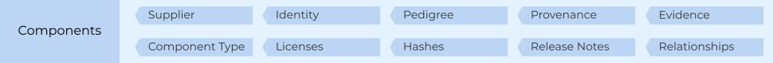
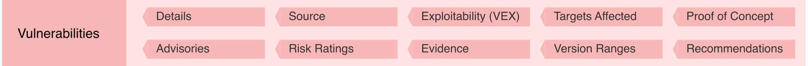
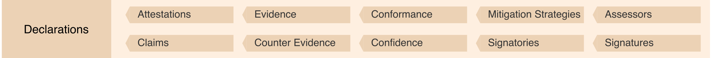

---
# Page settings
layout: document
keywords: application security, software security, software bill of material, SBOM, BOM, open source, supply chain, specification, spdx, license, package url, purl, cpe
comments: false
banner: false

# Hero section
title: CycloneDX Specification Overview
window_title: CycloneDX Specification Overview
description: CycloneDX Specification Overview

# Micro navigation
micro_nav: false

# Page navigation

---

# Specification Overview

&nbsp;<!-- without this hack, the dropdown menu has issues due to h1 and h2 happening right after each other -->

The CycloneDX object model:
* is defined in [JSON Schema](https://github.com/CycloneDX/specification/blob/1.6/schema/bom-1.6.schema.json), [XML Schema](https://github.com/CycloneDX/specification/blob/1.6/schema/bom-1.6.xsd), and [Protocol Buffers](https://github.com/CycloneDX/specification/blob/1.6/schema/bom-1.6.proto)
* is prescriptive and simple to use
* is designed for xBOM use cases, including <abbr data-title="Software Bill of Materials">SBOM</abbr>, <abbr data-title="Software-as-a-Service Bill of Materials">SaaSBOM</abbr>, <abbr data-title="AI/ML Bill of Materials">AI/ML-BOM</abbr>, <abbr data-title="Cryptography Bill of Materials">CBOM</abbr>, and <abbr data-title="Vulnerability Exploitability Exchange">VEX</abbr>
* can easily describe complex relationships
* is [extensible](#extensions) to support specialized and future use cases

## BOM Metadata
BOM metadata includes the supplier, manufacturer, and target component for which the BOM describes. It also includes
the tools used to create the BOM, and license information for the BOM document itself.

## Components
Components describe the complete inventory of first-party and third-party components. The specification can represent
software, hardware devices, machine learning models, source code, and configurations, along with the manufacturer
information, license and copyright details, and complete pedigree and provenance for every component.

## Services
Services represent external APIs that the software may call. They describe endpoint URIs, authentication
requirements, and trust boundary traversals. The data flow between software and services can also be described,
including the data classifications and the flow direction of each type.

## Dependencies
CycloneDX provides the ability to describe components and their dependency on other components. The dependency graph is
capable of representing both direct and transitive relationships. Components that depend on services can be represented
in the dependency graph, and services that depend on other services can be represented as well.

## Compositions
Compositions describe constituent parts (including components, services, and dependency relationships) and their
completeness. The aggregate of each composition can be described as complete, incomplete, incomplete first-party only,
incomplete third-party only, or unknown.

## Vulnerabilities
Known vulnerabilities inherited from the use of third-party and open-source software and the exploitability of the
vulnerabilities can be communicated with CycloneDX. Previously unknown vulnerabilities affecting both components and
services may also be disclosed using CycloneDX, making it ideal for both vulnerability disclosure and VEX use cases.

## Formulation
Formulation describes how something was manufactured or deployed. CycloneDX achieves this through the support of multiple
formulas, workflows, tasks, and steps, which represent the declared formulation for reproduction along with the observed
formula describing the actions which transpired in the manufacturing process.

## Annotations
Annotations contain comments, notes, explanations, or similar textual content which provide additional context to the
object(s) being annotated. They are often automatically added to a BOM via a tool or as a result of manual review by
individuals or organizations. Annotations can be independently signed and verified using digital signatures.

## Definitions
Standards, requirements, levels, and all supporting documentation are defined here. CycloneDX provides a general-purpose,
machine-readable way to define virtually any type of standard. Security standards such as OWASP ASVS, MASVS, SCVS, and
SAMM are available in CycloneDX format. Standards from other bodies are available as well. Additionally, organizations
can create internal standards and represent them in CycloneDX.

## Declarations
Declarations describe the conformance to standards. Each declaration may include attestations, claims, counter-claims,
evidence, counter-evidence, along with conformance and confidence. Signatories can also be declared and supports both
digital and analog signatures. Declarations provide the basis for "compliance-as-code".

## Extensions
Multiple extension points exist throughout the CycloneDX object model, allowing fast prototyping of new capabilities and
support for specialized and future use cases. The CycloneDX project maintains extensions that are beneficial to the
larger community. The project encourages community participation and the development of extensions that target specialized
or industry-specific use cases.

## High-Level Object Model

{: width="900"}

## Registered Media Types

The following media types are officially registered with IANA:

| Media Type | Format | Assignment |
| ------- | --------- | --------- |
| application/vnd.cyclonedx+xml | XML | [IANA](https://www.iana.org/assignments/media-types/application/vnd.cyclonedx+xml) |
| application/vnd.cyclonedx+json | JSON | [IANA](https://www.iana.org/assignments/media-types/application/vnd.cyclonedx+json) |

Specific versions of CycloneDX can be specified by using the version parameter. i.e. `application/vnd.cyclonedx+xml; version=1.6`.

The officially supported media type for Protocol Buffer format is `application/x.vnd.cyclonedx+protobuf`.

### Recognized file patterns

The following file names are conventionally used for storing CycloneDX BOM files -

- `bom.json` for `JSON` encoded CycloneDX BOM files.
- `bom.xml` for `XML` encoded CycloneDX BOM files.

Alternatively, files that match the glob pattern below are also recognized -

- `*.cdx.json` for `JSON` encoded CycloneDX BOM files.
- `*.cdx.xml` for `XML` encoded CycloneDX BOM files.

### Recognized predicate type

Many tools in the software supply chain capture attestations at the time of execution. A _predicate_ contains metadata 
about the attestation. Tools such as [in-toto](https://in-toto.io/) use predicate types to provide context about the 
subject of the predicate. OWASP recognizes `https://cyclonedx.org/bom` as the official predicate type for all CycloneDX
bill of material varieties including SBOM, SaaSBOM, and HBOM.